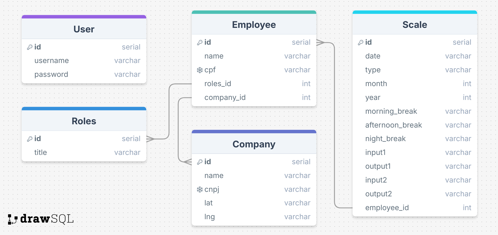

# Ponto Eletrônico API

Este projeto consiste em uma API desenvolvida para gerenciar pontos eletrônicos de funcionários em relação a escala de trabalho. Ele está dividido em dois componentes principais: iPonto e msAuthentication. Cada componente possui suas funcionalidades específicas e está organizado de forma modular, permitindo uma fácil manutenção e expansão.

### Módulo Company (Empresa)
Função: Gerencia as empresas registradas no sistema.

- Endpoint: POST /api/v1/company

Exemplo de JSON:
{
  "name": "Pão e Fermento ",
  "cnpj": "00.000.000/0000-00",
  "phone": "1234-5678",
  "lat": "123456789",
  "lng": "987654321"
}

Descrição: Este endpoint cria uma nova empresa no sistema utilizando os dados fornecidos no JSON.

### Módulo Employees (Funcionários)
Função: Gerencia os funcionários da empresa.

- Endpoint: POST /api/v1/employee

Exemplo de JSON:
{
  "name": "Nicolas Borges",
  "cpf": "000.000.000-00,
  "role_id": "Developer", #Necessário ter um role cadastrado.
  "company_id": 1
}

Descrição: Este endpoint adiciona um novo funcionário à empresa especificada.

- Endpoint: POST /api/v1/employee/{id}/point

Descrição: Este endpoint permite que o funcionário bata o ponto eletrônico. É possível bater até 4 pontos por dia.

- Endpoint: GET /api/v1/employees/

Descrição: Este endpoint lista todos os funcionários e suas descrições.

- Endpoint: PUT /api/v1/employee/<int:id>/

Descrição: Este endpoint edita os dados do funcionário.

### Módulo Roles (Cargos)
Função: Gerencia os cargos disponíveis para os funcionários.

- Endpoint: POST /api/v1/role

Descrição: Este endpoint cria um novo cargo no sistema.

### Módulo Scale (Escalas)
Função: Gerencia as escalas de trabalho dos funcionários.

- Endpoint: POST /api/v1/scale

Exemplo de JSON:
{
 "type": "default",
 "employee_id": [1],
 "month": 1,
 "year": 2024
}

Descrição: Este endpoint cria uma nova escala de trabalho para um funcionário específico, definindo os turnos (shifts) para cada dia.

- Endpoint: GET /api/v1/scale

Descrição: Retorna as escalas de trabalho cadastradas no sistema.

### Módulo User (Usuários)
Função: Gerencia a autenticação e autorização dos usuários do sistema.

Registrar Usuário:

- Endpoint: POST /api/v1/user/register

Exemplo de JSON:
{
 "username": "user1",
 "password": "senha123"
}
Descrição: Este endpoint registra um novo usuário no sistema.

Login:

- Endpoint: POST /api/v1/user/login

Exemplo de JSON:
{
 "username": "user1",
 "password": "senha123"
}

Descrição: Este endpoint permite que o usuário faça login e obtenha um token de autenticação.

### Bibliotecas e Ferramentas Utilizadas
- Python
- Flask
- Psycopg2
- PostgreSQL
- Postman
- pyjwt
- drawsql
